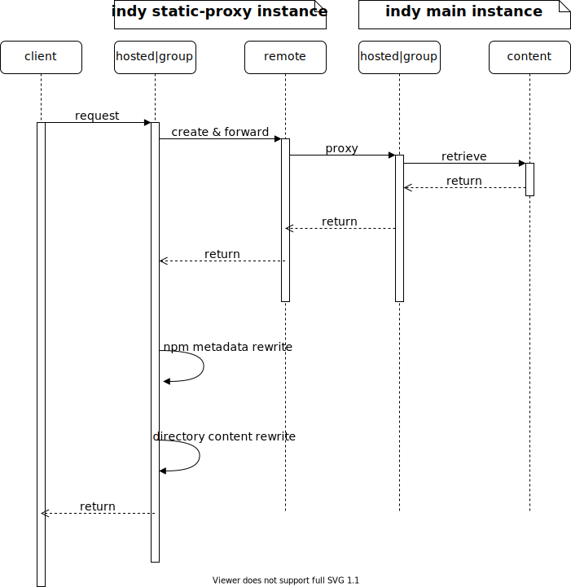

Indy Repository Proxy Addon
===

What is it?
---

Indy repository proxy addon provided a way to proxy some not existed hosted or group repositories to a remote repository which can point to some existed repositories on other indy instances. It is usually working as a helpful plugin to let indy working as a proxy server to other existed indy instances. 

Basic Workflow
---

Following sequence diagram shows how this addon is working. 

For details, working like following:

* Client requests an indy content api which includes hosted or group repository path in static-proxy instance, whenever these group or hosted repositories exist or not in the static-proxy instance.   
* The addon intercepts the request and gets the hosted|group repository from path.
* The addon try to find or create a remote repository based on a creator script, which will points to an external indy instance as proxy.
* The addon forwards the api request to this remote repository, and remote repository will retrieve content from its proxy-to target indy instance.
* All returned content will be rewritten by replacing the repository info to the requested one if it contains any original repository info, like NPM metadata content or directory listing content.
* The forwarded or rewritten content will be returned to client finally, which looks like it is from the original hosted|group repositories.

How to use?
---

#### Configuration

The configuration section of this addon is "[repo-proxy]", all configurations should be put under this section in indy configuration file. For the detailed configuration items please refer [default-repo-proxy.conf](./common/src/main/resources/default-repo-proxy.conf).

#### Repository Creator script

As described in workflow section, this addon needs to decide which remote repository it will forward to for coming hosted|group repository request. It uses a groovy script to do this part of work. By this script, it will get this remote repo, and then finds or creates it based on current state of the repo. A sample creator is like this one: [default-rule.groovy](./common/src/main/data/default-rule.groovy)

Note that this script should be put in ${indy.data}/repo-proxy/ folder in indy proxy instance.
