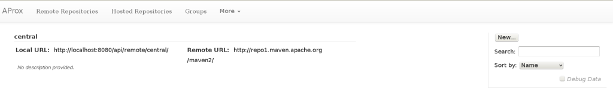

### Requirements

* Java 1.7 or above

### Download, Unpack, and Start

First, [download]({{site.data.urls.savantUrl}}) the AProx savant distribution tarball.

When the download completes, the following commands will unpack the AProx Savant distribution, change into the unpacked directory, and launch it.

    $ tar -zxvf aprox-launcher-savant-0.19.2-launcher.tar.gz
    $ cd aprox
    $ ./bin/aprox.sh

By default, AProx comes with the following repositories / groups pre-defined:

* Remote '[central]({{site.data.urls.centralProxyUrl}})' - which proxies the [Maven central repository]({{site.data.urls.centralUrl}})
* Hosted '[local-deployments]({{site.data.urls.localDeployUrl}})' - for deploying your own artifacts
* Group '[public]({{site.data.urls.publicUrl}})' - which is a grouping that initially contains only the 'central' repository proxy

Also by default, AProx will store all repository / group definition changes to a local Git repository under `aprox/var/lib/aprox/data`. To make the logs in this repository more meaningful, the UI will prompt you for a changelog message each time you make a change. If you connect via the Java client API, the methods for manipulating store (repository / group) definitions each accepts a changelog string as a parameter.

### Maven, Meet AProx

To use your AProx instance from a Maven build, download a `settings.xml` file tuned for use with the 'public' group from: [{{site.data.urls.publicSettingsUrl}}]({{site.data.urls.publicSettingsUrl}}). This settings file contains a <mirror> entry that directs Maven to use the your AProx 'public' group. It also contains a <localRepository> configuration that's designed to avoid cross-pollution of artifacts resolved using other `settings.xml` files.

As an example:

    $ cd my-project/
    $ curl {{site.data.urls.publicSettingsUrl}} > ./settings.xml
    $ mvn -s ./settings.xml clean install
    $ tree $HOME/.m2/repo-group-public/

### Getting to Know the Web User Interface (UI)

When you browse to [{{site.data.urls.uiUrl}}]({{site.data.urls.uiUrl}}), you will be immediately redirected to the remote repositories view (which is also available from anywhere in the UI via the **'Remote Repositories'** link in the top menu). This is the listing of remote repository proxies defined on your AProx instance:

On the right side of the screen, you should notice a text field labeled 'Search'. As you type in this field, the list of repositories visible should narrow accordingly. This is useful when you have many remote repositories and need to find something quickly. You can also re-sort the listing by remote URL if you wish. You can also click 'New' to define a new remote repository from this page.

If you click the name of a remote repository (in our case, **'central'**), you should see its proxy configuration:

Note the controls on the right that allow you to modify or delete this remote repository, or define a new one.

Hosted repository and group definitions are also available for the same listing, view, and modification functions, via the top menu. Advanced features are available via the **'More'** drop-down menu.

### What Version am I Running?!

In case you ever need information about what version of AProx you're running, or need to report an issue, you'll find all of that information in the footer of the UI:

Where appropriate, these sections are hyperlinked to relevant information. For instance, the **Commit ID** section is linked to the AProx GitHub repository, directly to the view of that commit. And the **Issues** section takes you directly to the GitHub issue manager for AProx, in case you need to report a problem.
