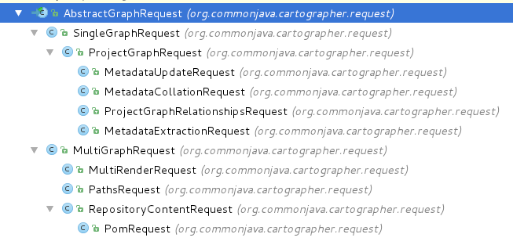

Depgraph requests come in one of two basic flavors that share some common properties: 

* [common properties](#common)
* [single-graph](#single-graph)
* [multi-graph](#multi-graph)

It's simplest to think of these requests as a class hierarchy, with a base class providing common properties and successive "child" classes adding more specificity. The "with extras" request types are obviously the most specific, specialized of the crowd. With the exception of the ProjectGraphRequest (a "with extras" variant of the single-graph request), these specialized requests are used in only one or two operations apiece.

Here's the full hierarchy:

##### Request Properties Common to All

Regardless of what flavor of Depgraph request you're building, it will have some of the following properties:

**Required:**

* **workspaceId** - The graph's database name
* **source** - The Indy store key to use when discovering graph relationships and nodes

**Optional:**

* **patcherIds** - List of keys identifying "patchers", or components run after relationships are extracted from a POM that will amend the relationship set based on some rule or other (see below).
* **resolve** - Defaults to `true`. If you set this to `false`, your operation will execute with whatever information is in the graph, and not try to discover missing nodes/relationships.
* **injectedBOMs** - List of GAVs referencing BOMs whose `dependencyManagement` sections should be read to establish a map of version selections to use in coercing GAVs during graph traversal or discovery.
* **versionSelections** - Map of GA to GAV that directly specifies the GAV coercions to be applied during graph traversal or discovery.
* **excludedSubgraphs** - List of GAVs beyond which traversal and discovery should halt.

##### Single-Graph Requests

Single-graph requests are simply that: one or more "root" GAVs whose graphs of relationships all exist in the same workspace with the same view parameters. Operations using single-graph requests are by far the most common in Depgraph, since you can achieve so much with filtering and "root" specification. These requests are often embellished with extra information required for particular operations, such as a set of target GAVs (for the paths operation), or a set of matching GAV patterns (for operations listing various types of project nodes), or even a set of metadata keys to collate.

All variants of the single-graph request have one common configuration section in common: a field in the main object called "graph", which is of type GraphDescription. A GraphDescription contains a set of root GAVs, a filter, a preset and accompanying map of preset parameters (which are used to select a filter on the server side), and a default preset. Of these, the filter and default preset are managed entirely on the server side, and are not used by clients at all.

##### Multi-Graph Requests

These requests concern the combination of two or more relationship graphs using a calculation of some sort as the combining operation. Regardless of the variant request type, multi-graph requests all contain a field called "graphs" of type GraphComposition. GraphComposition consists of a list of one or more GraphDescription objects (see single-graph requests above) and a (nullable) calculation. Available calculations include (from the GraphCalculationType enum):

* ADD
* SUBTRACT
* INTERSECT

If only one GraphDescription is provided, then the calculation is disregarded and the request operates as if it were a single-graph request. In fact, many of the operations that accept multi-graph requests are most commonly used in single-graph mode. The multi-graph graphs field is simply there to provide more flexibility.

Currently, the only truly multi-graph operations include calculating the diff (additions, subtractions) between two graphs, and calculating the target drift between two graphs (intended to be graphs of two versions of a GAV or GAV-set).

