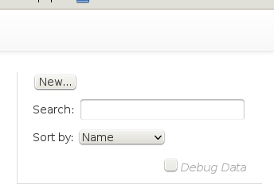
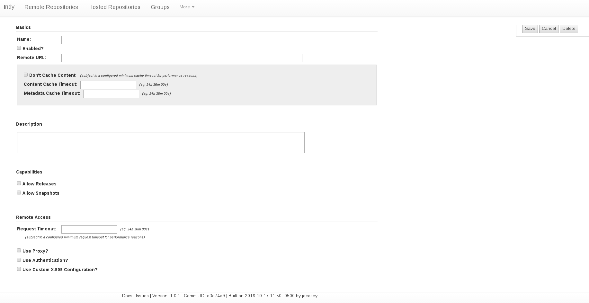
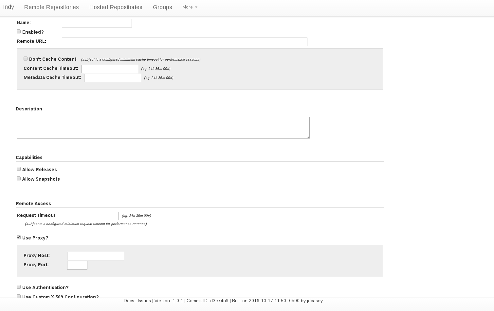

[Back](repos-groups.html) 
[Documentation Contents](index.html)

### Proxying Remote Repositories

Like any good repository manager, Indy supports proxying content from external (remote) repositories. In order to insulate users from network problems, this implies caching the proxied artifacts. It also implies streaming proxied data back to the user as soon as possible, without waiting for the caching step to complete. If the user has to wait for Indy to cache an artifact before receiving any content, this actually penalizes them for using a repository manager.

### Standard Features

#### Caching with flexible timeouts

Each remote repository (proxy) has a configurable timeout that determines how long Indy will hold cached content before getting rid of it. It also has a minimum cache timeout which is designed to hold onto an artifact at least as long as a modest build would take to execute...just in case its first and last modules need the same artifact. 

Accessing an artifact will reset the timeout for that file.

#### Marking failed proxy attempts (Not-Found cache)

Blindly pounding on remote repositories for content that has never existed there is not a very nice thing to do. To avoid this, Indy marks failed proxy attempts for each repository, and avoids re-checking for those artifacts for awhile. Each record in this not-found cache expires after awhile, allowing Indy to re-check just in case. You can also manually expire a not-found record from the UI.
 
#### Remote content listings

Face it, sometimes it's just easier to fire up the ol' browser and go look through a POM, take a look at the versions available for a project, or jog your memory for a particularly gnarly Maven groupId. In some repository managers, you only get to browse through the content that it has previously cached (and that hasn't expired yet). This can be pretty confusing, and it can mean that you still need to know the remote repository URLs so you can go browse them directly.

The better repository managers solve this dilemma for you by proxying directory listing content as well as the files themselves. Indy attempts to do this, and even caches the listing data (just like any artifact) to improve performance. Since it has to parse HTML to get the listing data from the remote server, it doesn't always produce a clean result, but it's usually a lot better than nothing.

### Extra Features

#### Passthrough-style caching (minimal cache timeout)

Sometimes using a repository manager is more about the aggregation of content from multiple sources (grouping, which we'll cover in detail below) than it is about insulating against network problems. When working in this mode, content found via remote repositories in your groups will often change fairly quickly, and you expect up-to-date access to that content. In this situation, cache timeouts are actually a bad thing, something to be minimized. 

Indy solves this problem by setting a global minimum cache timeout that makes sense to support a build of modest size without the need to re-cache content. With that set you can simply check a box flagging your remote repository as a pass-through and Indy won't cache content from that repository any longer than the absolute minimum. If you need to, you can then tune the minimum cache timeout in your Indy configuration and affect all pass-through repositories at once.

#### Per-repository SSL settings

Have you ever tried using a Java application to access content on a server that's protected by a self-signed certificate? What about servers that require client SSL certificates? These are too often nightmarish scenarios requiring you to maintain a custom Java keystore and manage the keys manually. And they're unusual enough that searching for documentation lands you on some backwater wiki page that hasn't been updated since 2009.

Not so with Indy. Each repository configuration can store a client SSL certificate (and passphrase), and the SSL certificate of the server (for accommodating self-signed certificates). In theory, you could even have two separate remote repository definitions connecting to the same remote site, but using two different client SSL certificates. Though, it's hard to imagine why you would. But you could...

#### Per-repository proxy settings

Each repository can have a separate proxy configuration, just like it can have its own SSL configuration.

### How to Setup a Remote Repository

Click on the `Remote Repositories` menu item at the top.

  

Click on the `New...` button on the right.

  

Fill out the details of the remote repository. The minimum information is the name and remote URL. 

  

Keep in mind that the relevant fields for advanced features like proxying, SSL, and authentication will become visible when you check the corresponding box at the bottom of the page. For example:

  

Once you're finished, click the `Save` button on the right, and add a changelog entry:

  

Click `Save` again to store your changes in a Git file revision containing the changelog as its message.
